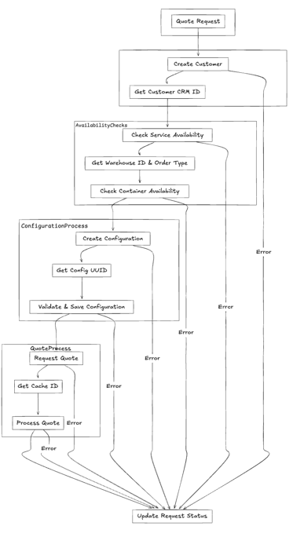
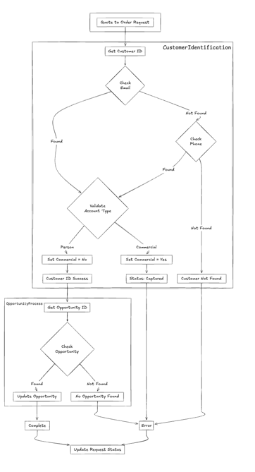
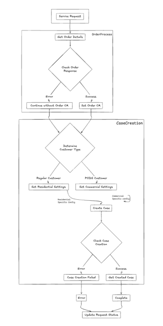

# Business Continuity Project - Run Book


### Request a Quote Flow
The quote request process handles customer inquiries for new services.



### Place Order Flow
The order placement process manages the conversion of quotes to confirmed orders.




### Existing Order Assistance Flow
The assistance process handles support requests for existing orders.




## Project Structure

```
root/
├── client/                  # React Frontend
│   ├── public/             # Static files
│   ├── src/
│   │   ├── components/     # Reusable React components
│   │   ├── pages/         # Page components
│   │   ├── hooks/         # Custom React hooks
│   │   ├── services/      # API services
│   │   ├── utils/         # Utility functions
│   │   ├── assets/        # Images, fonts, etc.
│   │   ├── styles/        # Global styles, themes
│   │   ├── types/         # TypeScript type definitions
│   │   ├── constants/     # Constants and configuration
│   │   ├── store/         # State management (Redux/Context)
│   │   ├── App.tsx        # Root component
│   │   └── index.tsx      # Entry point
│   ├── package.json
│   └── tsconfig.json      # TypeScript configuration
│
├── service/               # Spring Boot Backend
│   ├── src/
│   │   ├── main/
│   │   │   ├── java/com/pods/bcp/
│   │   │   │   ├── config/         # Configuration classes
│   │   │   │   ├── controller/     # REST controllers
│   │   │   │   ├── service/        # Business logic
│   │   │   │   ├── repository/     # Data access layer
│   │   │   │   ├── model/         # Domain models
│   │   │   │   ├── dto/           # Data transfer objects
│   │   │   │   ├── exception/     # Custom exceptions
│   │   │   │   ├── util/          # Utility classes
│   │   │   │   └── BcpApplication.java
│   │   │   └── resources/
│   │   │       └── application.yml
│   │   └── test/                  # Unit and integration tests
│   └── pom.xml                    # Maven configuration
└── README.md  
```

## Backend configuration

## Prerequisites
- PostgreSQL
- Java 21
- Spring Boot 3.x
- PODS Gateway services
- Salesforce credentials
- Required environment variables or configuration files

## Database Setup

### 1. Initial Database Creation
```sql
CREATE DATABASE "pods-bcp"
    WITH 
    OWNER = postgres
    ENCODING = 'UTF8'
    LC_COLLATE = 'en_US.UTF-8'
    LC_CTYPE = 'en_US.UTF-8'
    TABLESPACE = pg_default
    CONNECTION LIMIT = -1;
```

### 2. Schema Creation
Before running the application, execute all SQL queries present in:
```
src/main/resources/model.sql
```

## Application Configuration Guide
Set the spring profile to local in:
```
src/main/resources/application.yml
```
Make these configuration in :
```
src/main/resources/application-local.yml
```
### Database Configuration
```yaml
spring:
  datasource:
    driver-class-name: org.postgresql.Driver
    url: jdbc:postgresql://localhost:5432/pods-bcp    # Update host and port as needed
    username: <user-name>                             # Set your database username
    password: <password>                             # Set your database password
```

### Connection Pool Settings (HikariCP)
```yaml
    hikari:
      max: 10                      # Maximum pool size
      minimum-idle: 3              # Minimum idle connections
      connection-timeout: 30000    # Connection timeout in milliseconds
      idle-timeout: 600000        # Idle timeout in milliseconds
      max-lifetime: 1800000       # Maximum lifetime of connection
      keepalive-time: 300000      # Keep-alive time
```

### PODS Service Configuration
Required configurations for PODS services:
```yaml
pods:
  service:
    saleforce-base-url: <salesforce-url>              # Salesforce base URL
    gw-base-url: <gateway-url>                        # PODS Gateway base URL
    token-url: ${pods.service.gw-base-url}/pods-auth/getToken
    client-id: <client-id>                            # PODS client ID
    client-secret: <client-secret>                    # PODS client secret
```

### Service Endpoints Configuration
Configure the following service endpoints:
```yaml
    customer:
      url: ${pods.service.gw-base-url}/mule-accounts/v1/account
    serviceability:
      url: ${pods.service.gw-base-url}/getcalendar/Serviceability/v3
    availability:
      url: ${pods.service.gw-base-url}/getcalendar/ContainerAvailability/v4
```

### Salesforce Configuration
Required Salesforce credentials and endpoints:
```yaml
salesforce:
  token-url: <token-url>                # Salesforce token URL
  client-id: <client-id>                # Salesforce client ID
  client-secret: <client-secret>        # Salesforce client secret
  username: <username>                  # Salesforce username
  password: <password>                  # Salesforce password
```

### Case Management Configuration
```yaml
    case:
      get-order-url: ${pods.service.saleforce-base-url}/data/v63.0/sobjects/Order/Order_Id__c
      create-url: ${pods.service.saleforce-base-url}/data/v63.0/sobjects/Case
      recordtype-id:
        resd: <residential-record-type-id>    # Residential record type ID
        comm: <commercial-record-type-id>     # Commercial record type ID
      owner-id:
        resd: <residential-owner-id>          # Residential owner ID
        comm: <commercial-owner-id>           # Commercial owner ID
```

### Quote Configuration
```yaml
    quote:
      config-url: <config-url>                # Quote configuration URL
      token: <token>                          # Quote token
      product-id: <product-id>                # Product ID
      price-book-id: <price-book-id>          # Price book ID
```

## Scheduler Configuration

### Timing Configuration
```yaml
scheduler:
  time: 10    # Scheduler interval in minutes
```
### Request a quote flow delay configuration to avoid failures
```yaml
time:
   sleep: 5 # time to sleep between validation config and request quote
```

### Number of total requests to process
```yaml
scheduler:
   max-process: 10  # Default value
```
The scheduler runs at a fixed interval defined by the `scheduler.time` property:
- Default value: 10 minutes
- The scheduler will process pending requests every 10 minutes
- Can be configured to different values based on business needs

### Scheduler Examples

1. **Default Configuration (10 minutes)**
```yaml
scheduler:
  time: 1
```

2. **More Frequent Scheduling (5 minutes)**
```yaml
scheduler:
  time: 5
```

3. **Less Frequent Scheduling (30 minutes)**
```yaml
scheduler:
  time: 30
```

### Deployment with Custom Scheduler Time
You can override the scheduler time using VM arguments:
```bash
java -Dscheduler.time=15 -Dscheduler.enabled=true -Drequests.enabled=false -jar bcp-application.jar
```

### Scheduler Monitoring
To verify scheduler operation:
1. Check application logs for scheduler execution every `scheduler.time` minutes
2. Monitor processed requests in the database
3. View scheduler metrics through actuator endpoints

# SAML (SSO) Configuration

The application uses SAML (Security Assertion Markup Language) for authentication with Microsoft Azure AD. Below are the key configuration parameters:

```yaml
saml:
  metadata-url: https://login.microsoftonline.com/<tenant-id>/federationmetadata/2007-06/federationmetadata.xml?appid=<appid>
  entity-id: https://<env-host-address>/cpq-bcp/bcp-<env-value>
  acs-url: https://<env-host-address>/cpq-bcp/saml2/callback
  logout-url: https://login.microsoftonline.com/<tenant-id>/saml2
  logout-response-url: https://<env-host-address>/cpq-bcp/saml2/logout
```

## Configuration Parameters

- **metadata-url**: The URL to fetch the SAML metadata from Azure AD. This contains the federation information necessary for SAML authentication.

- **entity-id**: The unique identifier for your service provider (SP). This URL identifies your application to the identity provider.

- **acs-url**: The Assertion Consumer Service URL where SAML responses will be received and processed after successful authentication.

- **logout-url**: The URL endpoint on Azure AD that handles SAML logout requests.

- **logout-response-url**: The URL where users will be redirected after successful logout from the application.

This configuration enables Single Sign-On (SSO) functionality through Microsoft Azure Active Directory for the respective environment.
### Best Practices
1. Choose an appropriate interval based on:
  - System load
  - Business requirements
  - Processing volume
2. Consider peak vs. off-peak timing
3. Monitor scheduler performance
4. Adjust the interval if needed based on monitoring data

### Security Configuration
Create a secret key
```yaml
node -e "console.log(require('crypto').randomBytes(32).toString('hex'))"
```
```yaml
jwt:
  secret: <replace-with-new-secret-key>  # JWT secret key
  expiration: 900000                          # Token expiration in milliseconds
```

### Logging Configuration
```yaml
logging:
  level:
    org.springframework.web: INFO             # Adjust log level as needed
```

### Actuator Configuration
```yaml
management:
  endpoints:
    web:
      exposure:
        include: "*"                          # Expose all actuator endpoints
```

## Configuration Steps

1. **Database Setup**
  - Create PostgreSQL database
  - Execute SQL scripts from `model.sql`
  - Update database credentials in configuration

2. **Service Credentials**
  - Obtain PODS Gateway credentials
  - Configure Salesforce credentials
  - Set up necessary service accounts

3. **Endpoint Configuration**
  - Verify and configure all service endpoints
  - Ensure correct record type IDs and owner IDs
  - Configure quote-related settings

4. **Security Setup**
  - Review and update JWT secret if needed
  - Configure token expiration time
  - Set up necessary security policies

5. **Monitoring Setup**
  - Configure logging levels
  - Set up actuator endpoints
  - Review and adjust connection pool settings

## Environment-Specific Configurations

For different environments (dev, staging, prod), create separate configuration files:
- `application-dev.yml`
- `application-staging.yml`
- `application-prod.yml`

## Deployment Options

### VM Arguments for Deployment Modes
The application supports different deployment modes using VM arguments:

1. **Full Deployment (Default)**
  - Deploys both scheduler and request API endpoints
  - No additional VM arguments required
   ```bash
   java -jar bcp-application.jar
   ```

2. **Scheduler-Only Deployment**
  - Only deploys the scheduler functionality
  - Use the following VM arguments:
   ```bash
   java -Dscheduler.enabled=true -Drequests.enabled=false -jar bcp-application.jar
   ```

3. **Request API-Only Deployment**
  - Only deploys the request API endpoints
  - Use the following VM arguments:
   ```bash
   java -Dscheduler.enabled=false -Drequests.enabled=true -jar bcp-application.jar
   ```

### Deployment Mode Configuration Table

| Mode | scheduler.enabled | requests.enabled | Description |
|------|------------------|------------------|-------------|
| Full | true | true | Deploys both scheduler and request APIs (Default) |
| Scheduler Only | true | false | Deploys only scheduler functionality |
| Request API Only | false | true | Deploys only request API endpoints |
| None | false | false | Not recommended - no functionality deployed |

### Usage Examples

1. **Development Environment**
   ```bash
   java -Dscheduler.enabled=true -Drequests.enabled=false -Dspring.profiles.active=dev -jar bcp-application.jar
   ```

2. **Production Environment**
   ```bash
   java -Dscheduler.enabled=true -Drequests.enabled=false -Dspring.profiles.active=prod -jar bcp-application.jar
   ```

### Verification Steps
After deployment, verify the mode:

1. For Scheduler-Only mode:
  - Check scheduler logs for activity
  - Verify API endpoints are not accessible

2. For Request API-Only mode:
  - Verify API endpoints are accessible
  - Confirm scheduler is not running

## Validation Steps

1. Verify database connectivity
2. Test PODS Gateway connection
3. Validate Salesforce authentication
4. Check service endpoints accessibility
5. Verify JWT token generation
6. Test actuator endpoints

## Troubleshooting

Common configuration issues and solutions:
1. Database Connection Issues
  - Verify database credentials
  - Check database host accessibility
  - Confirm database exists and user has proper permissions

2. Service Connection Issues
  - Validate service endpoints
  - Check client credentials
  - Verify network connectivity

3. Authentication Issues
  - Verify JWT secret
  - Check Salesforce credentials
  - Confirm PODS Gateway token configuration


# Frontend React Application

This is a React-based frontend application that connects to a local API.

## Prerequisites

- Node.js (version 16 or higher)
- Yarn package manager
- Modern web browser

## Environment Setup

1. Create a `.env` file in the root directory of the project
2. Add the following environment variable:
   ```
   LOCAL_API_HOST=https://localhost:8080
   ```

## Installation

Install all dependencies using Yarn:

```bash
yarn install
```

## Development

To start the development server:

```bash
yarn dev
```

The application will be available at `http://localhost:4000`

## Available Scripts

- `yarn dev` - Starts the development server
- `yarn build` - Creates a production build
- `yarn test` - Runs the test suite
- `yarn lint` - Runs the linter
- `yarn preview` - Preview the production build locally

## Environment Variables

| Variable | Description | Required |
|----------|-------------|----------|
| LOCAL_API_HOST | Local API endpoint | Yes |

For support documents, please check out:
- PODS Files: [Documentation](https://pods.sharepoint.com/:f:/s/BusinessContinuity9/EtmVrVj5d-dBj23-6mKm_G4BgvPJkxSP7pJeWvDV-G1LGA?e=sTJqe5)
